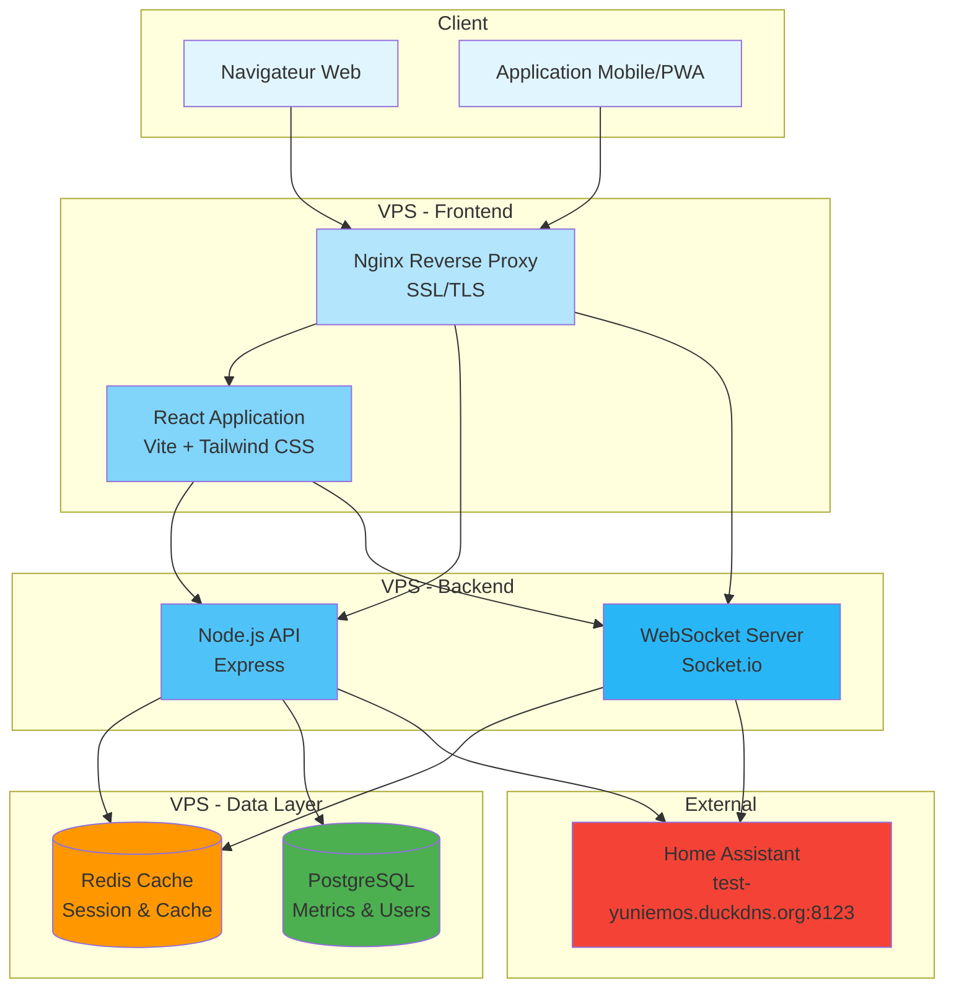
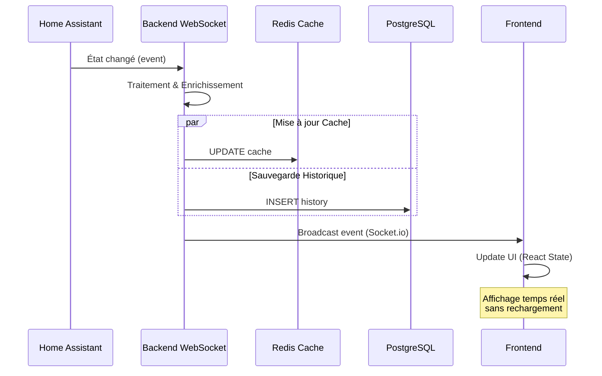
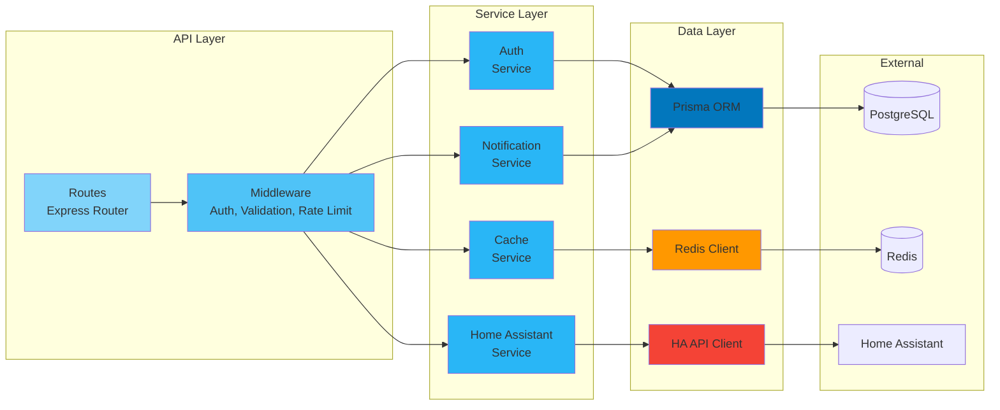
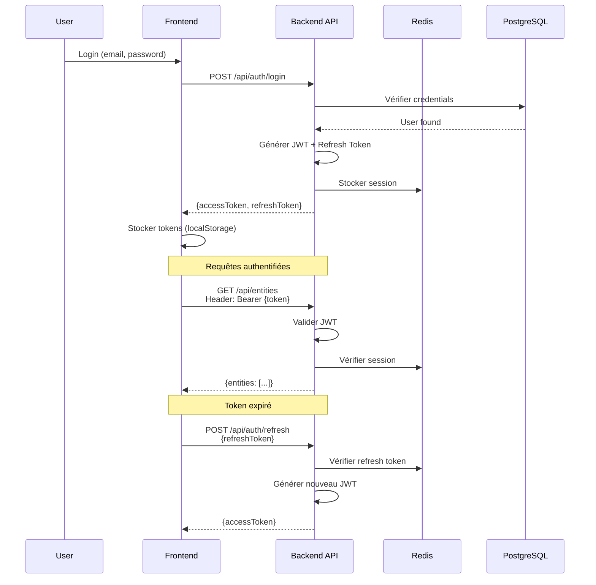
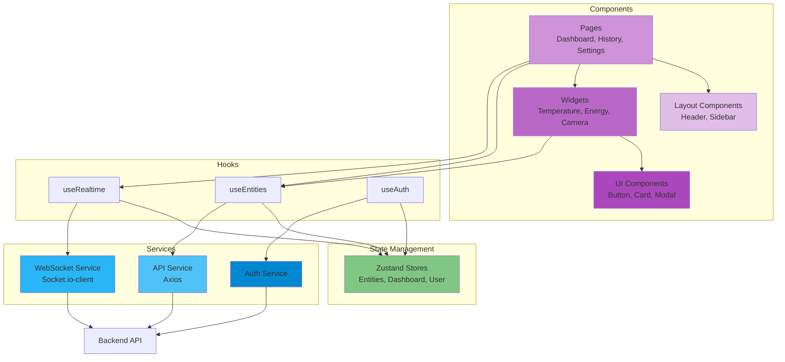
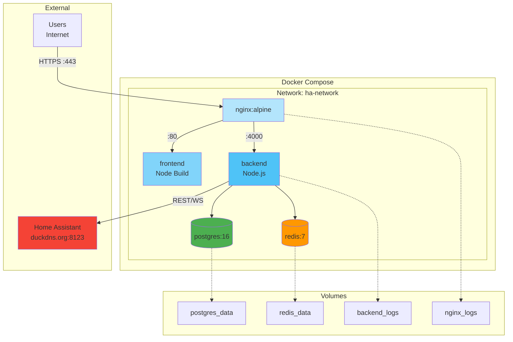
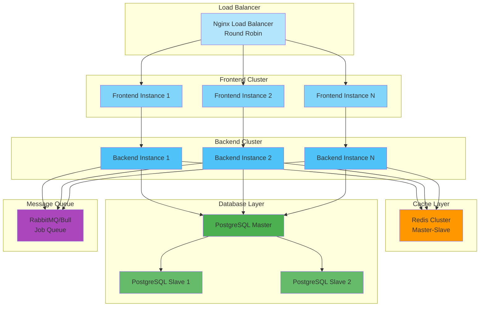
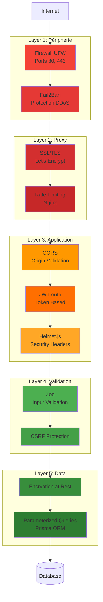

# Diagrammes d'Architecture

Ce fichier contient les diagrammes de l'architecture du système.

## Architecture Globale

## Flux de Données Temps Réel

## Architecture Backend en Couches

## Flux d'Authentification

## Architecture Frontend React

## Déploiement Docker

## Scalabilité Future

## Sécurité en Profondeur

---

Ces diagrammes peuvent être visualisés:
- Sur GitHub (rendu automatique)
- Sur GitLab (rendu automatique)
- Avec l'extension VS Code "Markdown Preview Mermaid Support"
- Sur https://mermaid.live/
